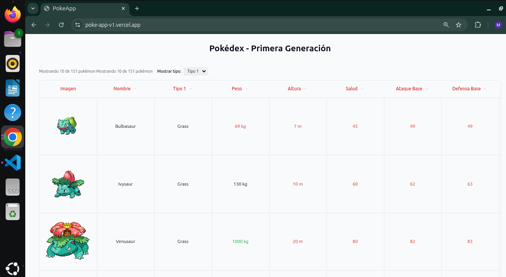
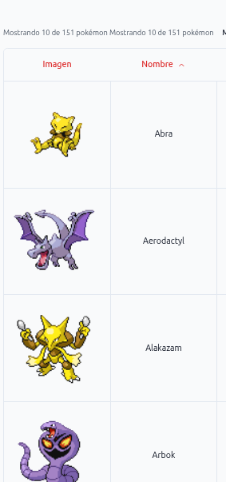
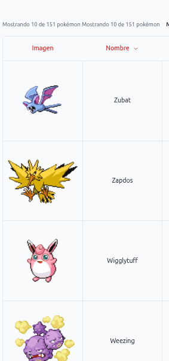
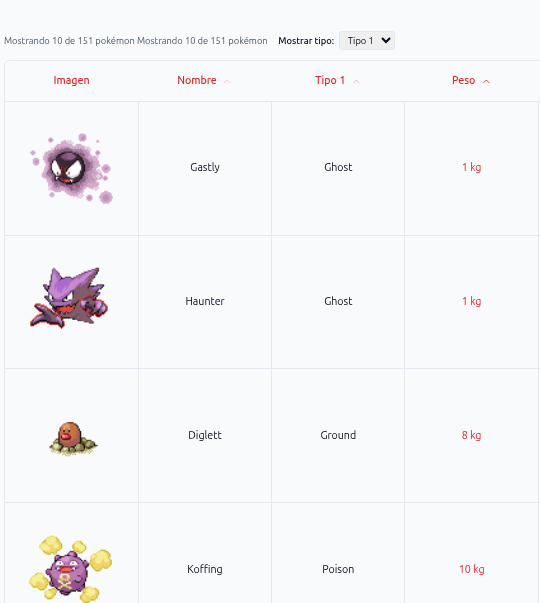
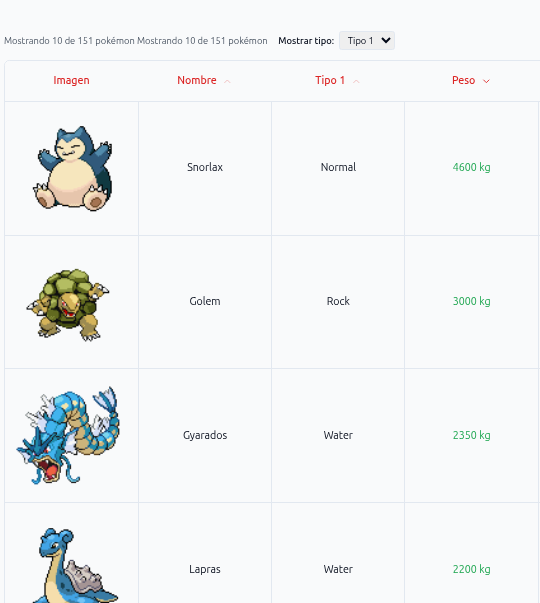
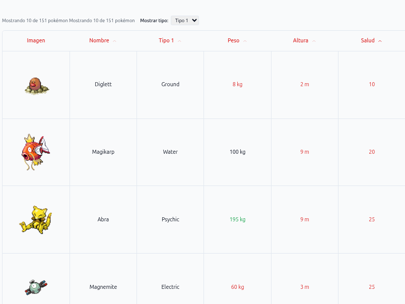
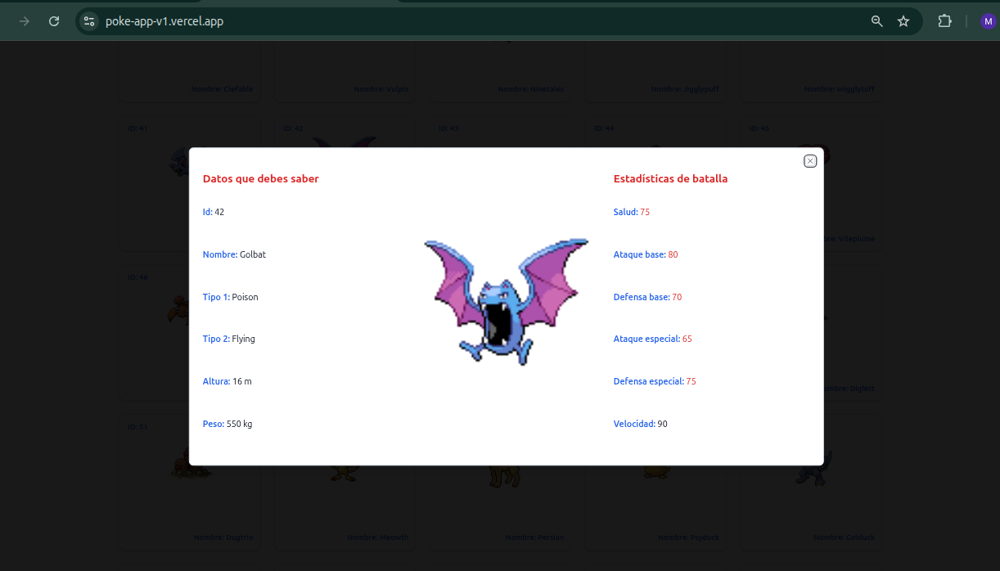
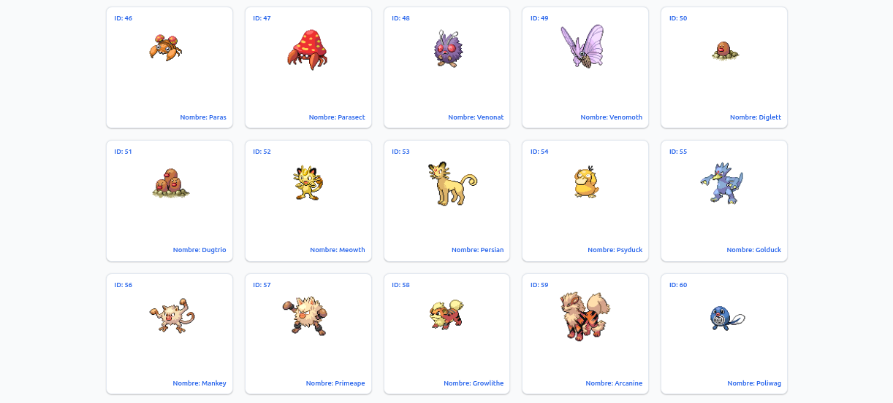
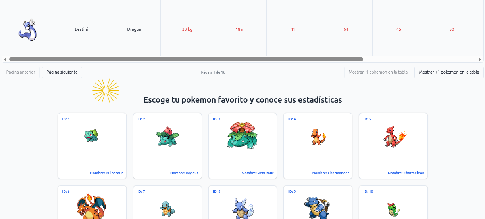

```markdown
# 🎮 Pokédex - Primera Generación

Una aplicación web moderna e interactiva que presenta los 151 Pokémon originales con múltiples formas de visualización y exploración.

🔗 **[Ver Demo en Vivo](https://poke-app-v1.vercel.app/)**

## 📸 Capturas de Pantalla


_Vista principal mostrando la tabla dinámica de Pokémon_


_Sistema de ordenamiento por cualquier columna con indicadores visuales - Nombre Ascedente_


_Sistema de ordenamiento por cualquier columna con indicadores visuales - Nombre Descendiente_


_Sistema de ordenamiento por cualquier columna con indicadores visuales - Peso Ascendiente_


_Sistema de ordenamiento por cualquier columna con indicadores visuales - Peso Descendiente_


_Sistema de ordenamiento por cualquier columna con indicadores visuales - Salud Ascendiente_


_Sistema de ordenamiento por cualquier columna con indicadores visuales - Salud Descendiente_


_Modal interactivo mostrando estadísticas completas del Pokémon_


_Vista de grid para exploración visual rápida_


_Efecto visual interactivo al hacer click en la aplicación_

## ✨ Características Principales

### 📊 Tabla Dinámica Avanzada

- **Ordenamiento bidireccional** por todas las columnas (nombre, stats, tipo)
- **Paginación dinámica** con control de elementos por página (10-50)
- **Selector de tipos** para alternar entre tipo primario y secundario
- **Indicadores visuales** con colores para valores altos (verde) y bajos (rojo)
- **Columnas informativas**: ID, imagen, nombre, tipo, peso, altura, y todas las estadísticas base

### 🎯 Modal de Detalles

- **Diseño de 3 columnas** con información organizada
- **Animaciones suaves** de entrada y salida
- **Datos completos**: información básica, imagen en alta calidad y estadísticas de batalla
- **Cierre intuitivo** con ESC o click fuera del modal

### 🎨 Grid Visual de Pokémon

- **Cards interactivas** con diseño moderno
- **Responsive automático** usando CSS Grid
- **Hover effects** con transformación suave
- **Integración con modal** al hacer click en cualquier card

### 🎯 Experiencia de Usuario

- **Click Spark Effect** en toda la aplicación para feedback visual
- **Diseño totalmente responsive** para móvil, tablet y desktop
- **Cache inteligente** en localStorage para carga instantánea
- **Skeleton loaders** durante la carga inicial

## 🛠️ Stack Tecnológico

### Core

- **React 18.3** - Librería de UI
- **TypeScript 5.2** - Type safety
- **Vite 5.0** - Build tool ultrarrápido

### Estado y Datos

- **Redux Toolkit** - Manejo de estado global
- **Axios** - Cliente HTTP
- **React Router v6** - Navegación

### UI y Estilos

- **Tailwind CSS 3.4** - Utility-first CSS
- **TanStack Table v8** - Tabla headless potente
- **shadcn/ui** - Componentes UI modernos
- **Lucide React** - Iconos SVG

### Extras

- **React Bits** - Click Spark effect
- **LocalStorage API** - Persistencia de datos

## 🚀 Instalación y Uso

### Prerrequisitos

- Node.js 18.x o superior
- npm o yarn

### Pasos de Instalación

1. **Clonar el repositorio**
   `git clone https://github.com/ManuelAlejandro93/PokeAppV1.git`
   `cd PokeAppV1`

2. **Instalar dependencias**
   `npm install`

3. **Iniciar servidor de desarrollo**
   `npm run dev`

4. **Abrir en el navegador**
   `http://localhost:5173`

### Scripts Disponibles

`npm run dev` # Inicia servidor de desarrollo
`npm run build` # Construye para producción
`npm run preview` # Vista previa de la build
`npm test` # Ejecuta tests (Jest)

## 📁 Estructura del Proyecto

src/
├── components/
│ ├── PokemonTable/ # Tabla dinámica con TanStack
│ ├── PokemonModal/ # Modal de detalles
│ └── PokemonGrid/ # Grid visual de cards
├── hooks/
│ └── usePokemonModal.ts # Lógica del modal
├── store/
│ └── slices/
│ └── PokemonSlice.ts # Estado global con Redux
├── interfaces/ # TypeScript interfaces
└── pages/
└── HomePage.tsx # Página principal

## 🎮 Uso de la Aplicación

1. **Tabla Dinámica**

   - Click en los headers para ordenar
   - Usa el selector para cambiar entre Tipo 1 y Tipo 2
   - Ajusta pokémon por página con los botones
   - Navega entre páginas

2. **Ver Detalles**

   - Click en el ícono de ojo en la tabla
   - O click en cualquier card del grid
   - Cierra con ESC o click fuera

3. **Exploración Visual**
   - Desplázate hacia abajo para ver el grid
   - Hover sobre las cards para efecto de zoom
   - Click para ver detalles completos

## 🔧 Configuración Adicional

### Prettier (Formateador de código)

El proyecto usa Prettier para mantener consistencia en el código. La configuración se aplica automáticamente.

### Tailwind CSS

Configurado con todas las animaciones y utilidades necesarias. No requiere configuración adicional.

## 🐛 Solución de Problemas

### La aplicación no carga datos

- Verifica tu conexión a internet
- Limpia el localStorage: `localStorage.clear()` en la consola
- Recarga la página

### Los estilos no se ven correctamente

- Asegúrate de que todas las dependencias estén instaladas
- Verifica que Tailwind CSS esté funcionando

## 🤝 Contribuciones

Las contribuciones son bienvenidas. Por favor:

1. Fork el proyecto
2. Crea tu feature branch (`git checkout -b feature/AmazingFeature`)
3. Commit tus cambios (`git commit -m 'Add some AmazingFeature'`)
4. Push al branch (`git push origin feature/AmazingFeature`)
5. Abre un Pull Request

## 📄 Licencia

Este proyecto está bajo la Licencia MIT. Ver el archivo [LICENSE](LICENSE) para más detalles.

## 👨‍💻 Autor

**Manuel Alejandro Pinzón Aguirre**

- 🌐 [Portfolio](https://portfolio-astro-silk-phi.vercel.app/)
- 💼 [LinkedIn](https://www.linkedin.com/in/manuelpinzon/)
- 📧 [Email](mailto:clasefisica2019@gmail.com)
- 🐙 [GitHub](https://github.com/ManuelAlejandro93)

## 🙏 Agradecimientos

- [PokeAPI](https://pokeapi.co/) por proporcionar los datos
- [shadcn/ui](https://ui.shadcn.com/) por los componentes
- [Vercel](https://vercel.com/) por el hosting

---

⭐ Si te gustó este proyecto, ¡no olvides darle una estrella!
```
